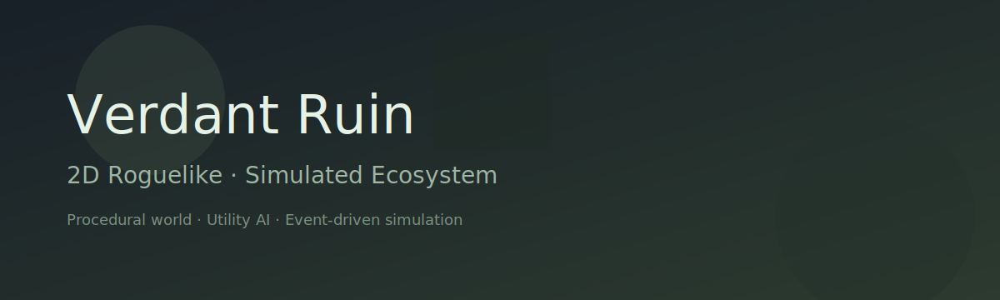

# Verdant Ruin

Verdant Ruin is a 2D roguelike with a simulated ecosystem. The world is procedural, NPCs are driven by Utility AI + FSM, and events form a causal chain between player action and world response. The project targets Unity 2022 LTS and is built with a modular, data-driven architecture suitable for long-term iteration.

## Quick Start
1) Open the project with Unity 2022 LTS.
2) Open or create a scene, then add these components:
   - `GameRoot`
   - `TickDriver`
   - `LogicDriver`
   - `WorldGenDriver`
   - `RenderSystem`
   - `PlayerInputSystem`
   - Optional: `SaveDriver`, `SaveHotkeys`, `SaveUI`, `StatusHud`
3) Press Play.

## Controls
- Move: `W` `A` `S` `D`
- Save snapshot (memory): `F5`
- Load snapshot (memory): `F9`

## Save Files
- Save path: `Application.persistentDataPath`
- UI buttons (if `SaveUI` is attached) write to `save.json` by default.

## MVP Features
- Procedural Tilemap generation (64x64 default).
- Player and 10 NPCs spawn and move.
- Logic Tick (10 Hz), AI Tick (2 Hz), Simulation Tick (1 Hz).
- Event queue with serialized events.
- Save/Load with deterministic RNG state.
- Incremental render updates via `WorldDiff`.

## How to Play (Current Build)
1) Start the game.
2) Explore the grid; NPCs wander.
3) Use save/load to verify determinism.

## Architecture Snapshot
- `WorldState` is the single source of truth.
- Only `CommandExecutor` writes `EntityState`.
- `EventState.EventQueue` is the authoritative event queue (serializable).
- Rendering consumes `WorldDiff` and clears it once in `LateUpdate`.

## Repository Structure (Assets/Scripts)
- `Core`: tick, RNG, root wiring
- `World`: state + generation
- `Commands`: command queue/executor
- `AI`: intent and behavior
- `Events`: bus + event types
- `Simulation`: ecosystem tick (MVP)
- `Rendering`: tile/entity views + HUD
- `Save`: JSON save/load

## Roadmap
- Tile/Entity resources via config assets
- Utility AI scoring visualization
- Event history and replay
- Biome-driven worldgen
- Interaction/loot systems

## Credits
Made with Unity 2022 LTS.
